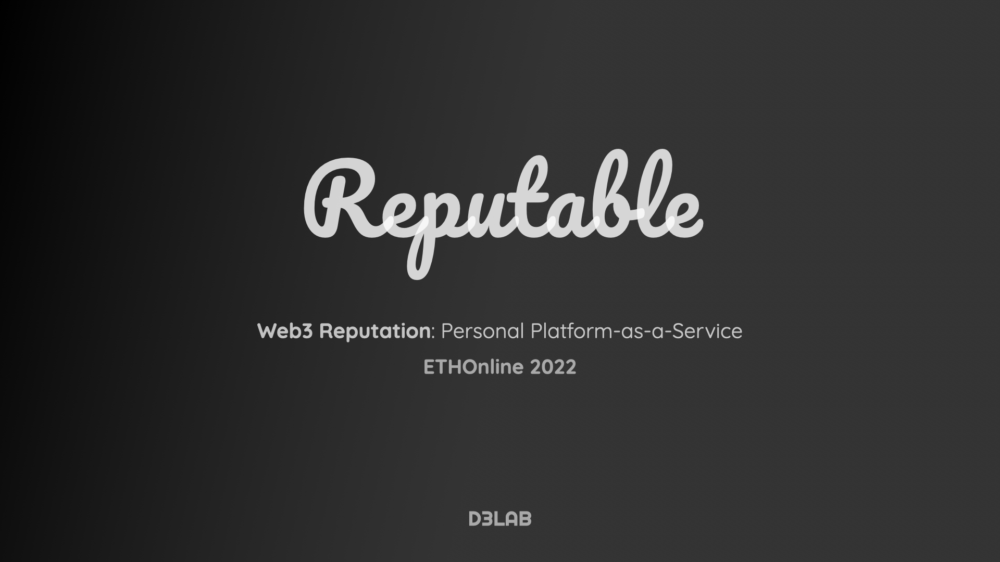
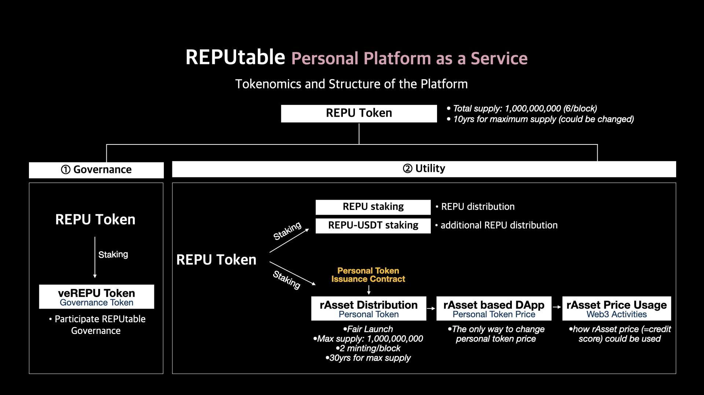

# Reputable



`Reputable` makes it easy for users to create their own tokens. Tokens may be used for various services. Since all tokens have a common total supply and inflation rate, the price becomes personal credit. It is useful for designing credit-based apps such as dynamic returns.

## Token Economy



# How to Deploy

```
$ npx hardhat run scripts/deploy.js
```

## Contracts

### Reputable

- RepuFactory.sol
- RepuERC20.sol

### Governance

- REPU.sol
- veREPU.sol
- Governor.sol
- Timelock.sol

<!--
# Technologies

- ENS

# Special Thanks to

- Uniswap
- Sushiswap
- Compound
- Curve
- Zapper
- And the other all open-sources creators 
-->
